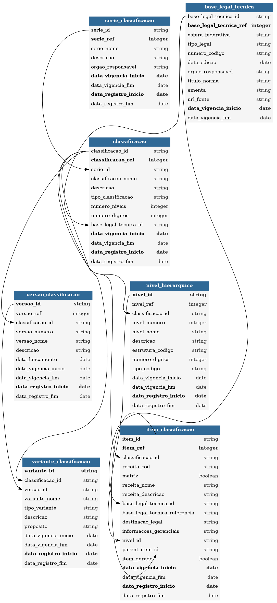

# Diagrama Entidade-Relacionamento (ERD)

Esta página apresenta o **diagrama entidade-relacionamento (ERD)** do sistema de gestão do Classificador de Natureza de Receita de Minas Gerais.

O diagrama sintetiza as principais entidades do domínio (como classificações, versões, variantes, relações hierárquicas) e seus relacionamentos, servindo como referência visual para modelagem de dados, integrações e evolução do esquema.

**Diagrama ERD**

